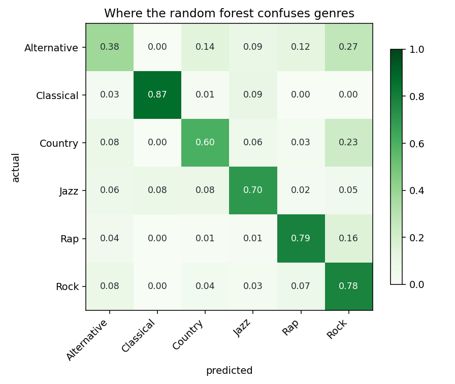
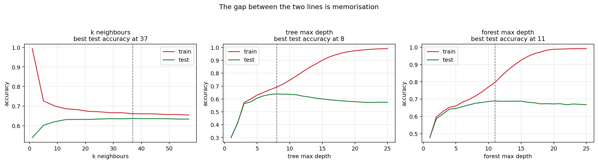
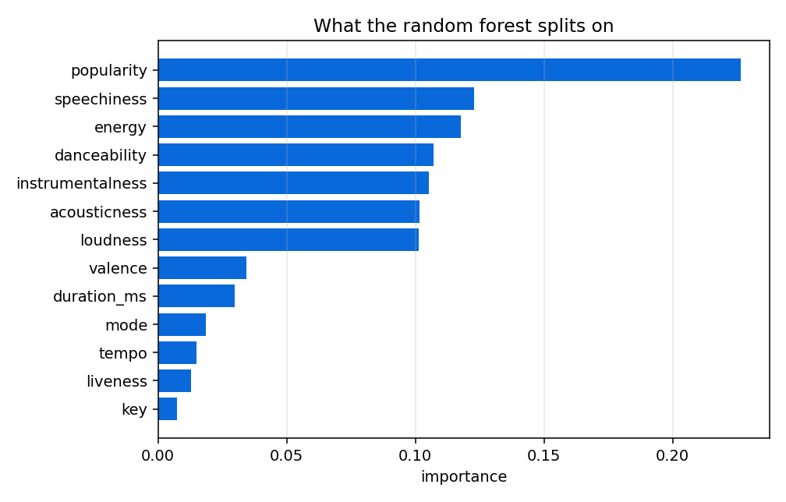

# Music Genre Classification

Predicts the genre of a track from its audio features, comparing k-nearest
neighbours, a decision tree and a random forest on the same split. 30,000 tracks
across six evenly balanced genres.



## Requirements

Python 3.10 or later.

## Installation

```bash
pip install -e .
```

With the test suite:

```bash
pip install -e ".[dev]"
```

## Usage

```bash
python -m genre.cli
```

Trains all three models, writes `results/metrics.json` and every figure in
`docs/`. Add `--skip-sweeps` to skip the hyperparameter curves, which are the
slow part.

As a library:

```python
from genre import load, random_forest, score, split

dataset = load("data/dataset.csv")
x_train, x_test, y_train, y_test = split(dataset)

model = random_forest()
model.fit(x_train, y_train)
print(score(y_test, model.predict(x_test)).format())
```

## Results

Stratified 67/33 split, seed 1, 20,100 train and 9,900 test.

| model | test accuracy | test F1 | train accuracy | gap |
| --- | --- | --- | --- | --- |
| k-nearest neighbours, k=15 | 63.2% | 0.631 | 68.3% | 5.1 |
| decision tree, depth 9 | 64.2% | 0.636 | 68.0% | 3.8 |
| random forest, 25 trees | **68.7%** | **0.683** | 77.0% | 8.3 |

Six balanced classes, so chance is 16.7%.

The forest wins by four and a half points over a single tree, which is the
ensemble doing its job: individual trees overfit in different directions and
averaging cancels much of that. It pays for the gain with the widest train-test
gap of the three, 8.3 points against the tree's 3.8.



The sweeps show the same thing directly. Training accuracy climbs without limit
as tree depth grows while test accuracy peaks and then flattens or declines. The
distance between the two lines is memorisation, and where they separate is where
the useful depth ends.

### Which genres are actually separable

The confusion matrix is the most informative result here, and it is not uniform.

| genre | correctly classified |
| --- | --- |
| Classical | 87% |
| Rap | 79% |
| Rock | 78% |
| Jazz | 70% |
| Country | 60% |
| Alternative | 38% |

Classical is nearly solved, which makes sense: high acousticness, low
speechiness, low energy, nothing else in the set looks like it. Alternative is
the opposite, at 38%, and its errors are not scattered. It is taken for Rock 27%
of the time and Country 14%.

That is a property of the label, not a failure of the model. Alternative is a
marketing category rather than an acoustic one, and a track filed under it is
usually rock by every measurable property. No amount of tuning separates two
labels that describe the same sound.



## Data handling

**Identifiers are dropped.** `artist_name` and `track_name` are removed before
training. Keeping the artist would let the model memorise which artist makes
which genre rather than learning anything about the audio, and it would score
well for the wrong reason.

**Missing values are filled with the column median.** Three columns have gaps
covering roughly a tenth of the rows between them; dropping those rows discards
far more signal than the gaps represent. The median rather than the mean, since
these distributions are skewed and a few very long tracks would drag the mean
away from typical.

**KNN sits behind a scaler.** It decides by distance, and `duration_ms` runs to
six figures while `danceability` sits in [0, 1]. Unscaled, the neighbourhood is
determined by duration alone. The tree and forest split on thresholds, so scaling
makes no difference to them.

**The split is stratified.** Even on a balanced dataset a random split of six
classes drifts a point or two, and that drift lands directly in the reported
accuracy.

## Project structure

```
genre/
    data.py       loading, cleaning, encoding, splitting
    models.py     the three classifiers
    evaluate.py   metrics and the overfitting gap
    figures.py    sweeps, confusion matrix, feature importance
    cli.py        the full run
tests/            loading, splitting, model and metric tests
data/             the track dataset
docs/             figures referenced by this README
results/          metrics from the most recent run
pyproject.toml    packaging
```

## Components

| module | responsibility |
| --- | --- |
| `data` | CSV to numeric features and integer labels, and the stratified split |
| `models` | Builds each classifier with its defaults |
| `evaluate` | Weighted metrics, confusion matrix, train-test gap |
| `figures` | The three plots in `docs/` |
| `cli` | Runs everything and writes the artefacts |

## Testing

```bash
python -m pytest tests/
```

Fifteen tests covering identifier removal, label encoding, median filling rather
than row dropping, stratification holding class proportions, KNN scaling its
input, every model fitting and predicting, and each metric. A small synthetic CSV
stands in for the dataset, so the suite runs in a second.
